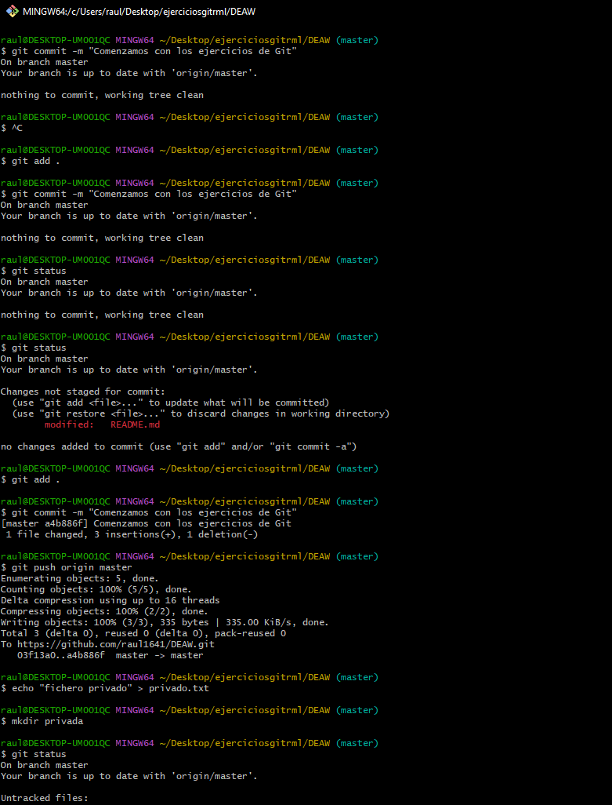
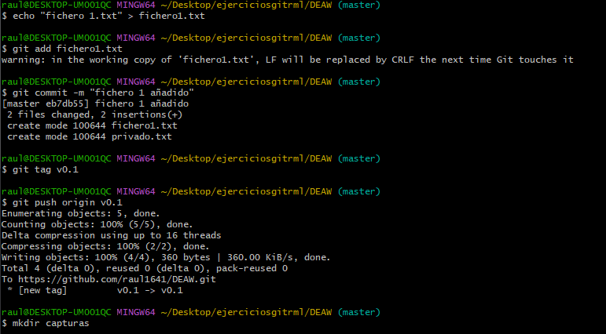

# Proyecto DEAW

Este es un proyecto de aprendizaje sobre Git y GitHub.

## Pasos realizados de RML 

### 1. Ejercicios GIT
Captura del comando `git status` después de inicializar el repositorio:

Aquí está la captura tras crear el archivo `1.txt` y la etiqueta `v0.1`:

NOMBRE        GITHUB
ismael        Astivero-x3d
sergio        Sergiws
raul          raul1641

